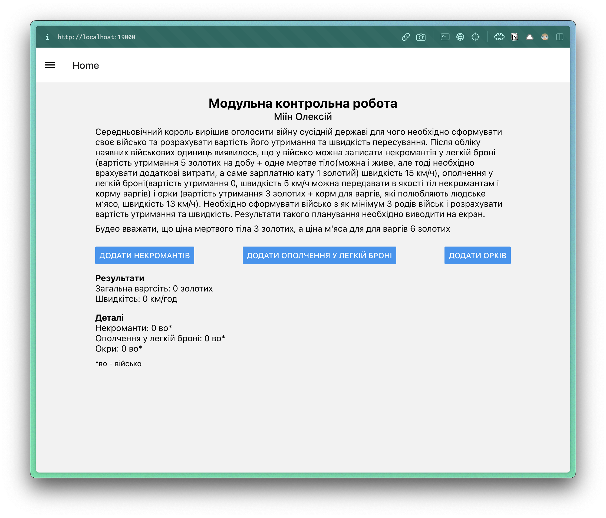

# Модульна контрольна робота

Щоб запустити локально у браузері:

```sh
npm run web
```

> Для цього потрібно версія NodeJS <= 16

## Результати

Початковий стан застосунку:



Після додавання 1 війьска некромантів, 1 війська ополчення у легкій броні та 2 військ орків:


